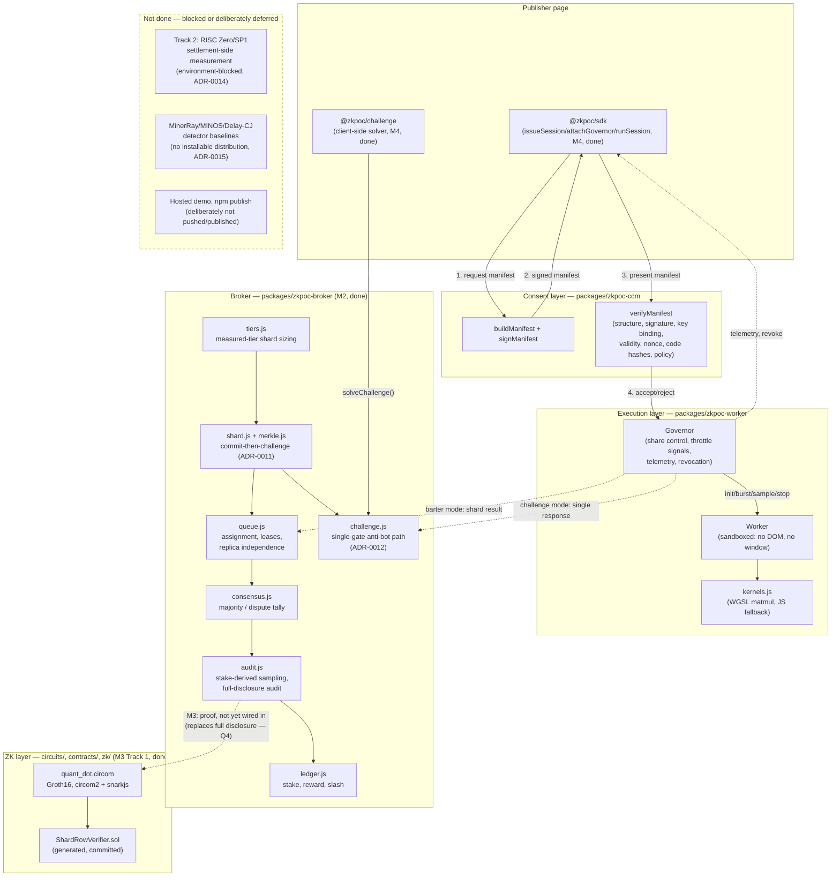
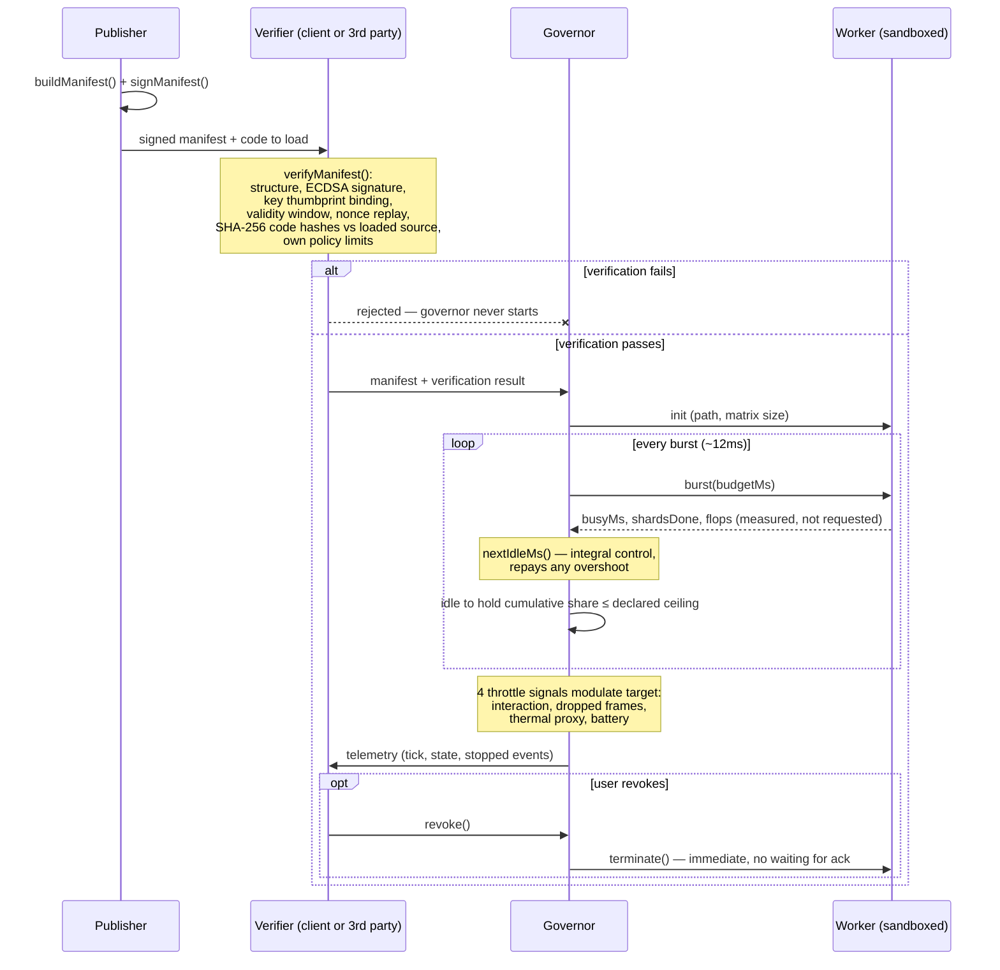

# Architecture

## The one-paragraph version

A page issues a **Compute Consent Manifest** — a signed, hash-bound
declaration of what it wants to run, how much of the device, for how long. A
verifier (the client, or a third party who trusts neither publisher nor
broker) checks the signature, checks the loaded code hashes match what was
declared, and checks the request fits their own policy. Only then does a
**resource governor** start a sandboxed **Worker**, which executes compute
shards under a share ceiling the governor enforces by withholding scheduling
time, not by asking the workload to behave. Everything downstream — the
broker, tiered verification, settlement — assumes this consent layer already
ran. See [ADR-0002](adr/0002-legitimacy-by-declaration-not-detection.md) for
why it's structured this way rather than around miner detection.

## Components

| Directory | Responsibility | Status |
| --- | --- | --- |
| `packages/zkpoc-ccm/` | Manifest schema, canonicalisation, signing, third-party verification | **Done** — 28 tests |
| `packages/zkpoc-worker/` | Resource governor, sandboxed shard worker, compute kernels | **Done** — 6 tests |
| `packages/zkpoc-broker/` | Shard model, tier sizing, queue, consensus, audit, ledger, challenge protocol | **Done** — 170 tests |
| `bench/` | Economic model, device measurement, dispatch/power analysis, attacker-advantage measurement | **Done** — M0/M2 |
| `demo/` | Live meter, tamper panel, revocation demo | **Done** |
| `circuits/` | Circom circuit for the must-land in-browser proof | **Done** — M3 Track 1 |
| `contracts/` | Generated Solidity Groth16 verifier | **Done** — M3 Track 1 |
| `zk/` | Isolated circom2/snarkjs/Hardhat toolchain (build + test), not in root workspaces | **Done** — M3 Track 1, [ADR-0014](adr/0014-m3-track1-toolchain-and-track2-blocked.md) |
| Track 2 (settlement-side zkVM) | RISC Zero/SP1 proving-overhead measurement | **Blocked** — no Rust toolchain in this environment, [ADR-0014](adr/0014-m3-track1-toolchain-and-track2-blocked.md) |
| `packages/zkpoc-sdk/` | Publisher integration — issue, verify, run a governed session | **Done** — M4, 5 tests |
| `packages/zkpoc-challenge/` | Anti-bot widget — client-side challenge solver | **Done** — M4, 3 tests |
| `explainer/` | W3C/WICG Compute Consent Manifest explainer | **Done** — M4, experimental/project-local |
| Dual-use detector baselines (MinerRay/MINOS/Delay-CJ) | Run against this system, report the outcome | **Blocked** — no installable distribution, [ADR-0015](adr/0015-dual-use-detectors-environment-blocked.md) |
| Hosted demo, npm publish | Public deploy of `demo/`, `@zkpoc/sdk` + `@zkpoc/challenge` on the registry | **Deliberately not done** — externally-visible actions left to the maintainer |

See [roadmap.md](roadmap.md) for the milestone breakdown this table summarises.

## Trust boundaries

This is the part a security reviewer actually cares about — who is trusted to
do what, and what happens when they lie.

**What each party is trusted for, and what they aren't:**

- **The publisher** is trusted to sign honestly, but *nothing downstream
  trusts them to have signed something benign* — see
  [ADR-0002](adr/0002-legitimacy-by-declaration-not-detection.md). A signed
  manifest for a miner is still a miner; the manifest makes it attributable,
  not automatically legitimate.
- **The verifier** is not trusted by the governor — verification happens
  *before* the governor is handed anything, and the governor refuses to start
  (`State.DENIED`) if `verification.ok` is false, independent of what the
  manifest itself claims.
- **The worker** is not trusted to self-limit. It reports measured busy time;
  the governor derives the schedule. A compromised kernel can return wrong
  *results* — caught by the redundancy/audit layer in barter mode
  ([ADR-0006](adr/0006-audit-rate-from-inspection-game.md),
  `packages/zkpoc-broker/src/consensus.js` + `audit.js`) or the
  single-submission gate in challenge mode
  ([ADR-0012](adr/0012-challenge-mode-single-submission-gate.md)) — but it
  cannot award itself more compute time, because it never controls its own
  scheduling.
- **The user** can revoke unconditionally at any point;
  `Governor.revoke()` terminates the worker immediately rather than waiting
  for it to finish its current burst.
- **`data_access` containment** is structural where the current implementation
  makes it structural (a dedicated Worker has no DOM), and asserted-only
  where it isn't yet (storage/network denial is a manifest claim the embedder
  is expected to enforce, not yet independently proven — see the manifest
  spec's "What this does not do" section).

## Data flow: one session, start to finish

1. Publisher calls `buildManifest()` + `signManifest()`
   (`packages/zkpoc-ccm/src/ccm.js`) — binds workload class, resource limits,
   data-access scope, and SHA-256 hashes of the worker/kernel source that will
   run.
2. A verifier — the demo, or in principle a browser extension — calls
   `verifyManifest()` with the manifest, the issuer's public key, the *actual
   loaded source* to hash and compare, and its own policy limits. Every check
   (`structure`, `signature`, `key_binding`, `validity_window`,
   `nonce_freshness`, `code.worker`, `code.kernels[i]`, `policy`) is reported
   independently.
3. If `verification.ok`, a `Governor` is constructed with the manifest and
   verification result and `start()`ed. It spins up a dedicated `Worker`
   running `packages/zkpoc-worker/src/worker.js`.
4. The governor drives a burst loop: ask the worker for `budgetMs` of work,
   receive back *measured* busy time and FLOPs, then idle for exactly as long
   as [`nextIdleMs()`](adr/0005-integral-share-control.md) says is needed to
   hold the cumulative share at or under the manifest's ceiling.
5. Four signals (interaction, frame health, a thermal proxy, battery) modulate
   a multiplicative back-off factor applied to the target share every cycle.
6. Telemetry (`tick`, `state`, `stopped` events) carries live share, energy
   estimate, and throttle state out to the page. `sampleResult()` lets the
   page spot-check a result against an independently-computable reference
   value, rather than trusting the worker's output.
7. The session ends via `duration_max_s`/`expires_at`/`energy_max_mwh`
   expiry, a battery floor, an explicit `stop()`, or user-initiated
   `revoke()` — the last of which terminates the worker immediately.

Step 8 onward forks into two structurally different pipelines
(`packages/zkpoc-broker/`), deliberately not sharing a verification or
reward path — see [ADR-0012](adr/0012-challenge-mode-single-submission-gate.md)
for why reusing one underneath the other was rejected.

## Two verification pipelines: barter and challenge

**Barter** (crowdsourced compute, a worker paid for confirmed work — time to
wait for redundancy, a persistent staked identity):

1. `tiers.js#chooseShardSize` sizes a shard from a measured device tier,
   refusing to guess for an unmeasured one (`UnmeasuredTierError`).
2. `queue.js#ShardQueue` assigns it to `redundancy` distinct workers, each
   holding a time-limited lease; identity independence is enforced even
   across expired leases, and a shard that exhausts its retry budget with no
   outstanding work is marked abandoned rather than left pending forever.
3. Each submission is a Merkle-committed, commit-then-challenge response
   (`shard.js`/`merkle.js`, [ADR-0011](adr/0011-commit-then-challenge-row-verification.md))
   — the challenge is derived from the worker's *own* root, so producing a
   valid one costs the full computation, not a sampled fraction of it.
4. `consensus.js#reachConsensus` gates every submission individually, then
   tallies valid roots: a clear majority CONFIRMS, a tie or split DISPUTES.
5. A dispute forces `audit.js#auditFull` — full-row disclosure, not the k-row
   sample — regardless of the workers' stake. Ordinary (non-disputed) audit
   selection is still stake-derived (`minAuditRate`, a\* = 1/(1+k)) and
   Fiat-Shamir-unpredictable before a worker commits, mirroring how the
   challenge itself is derived.
6. `ledger.js#CreditLedger` pays confirmed work and slashes what an audit
   catches — stake and earned balance are separate pools, so a worker's own
   payout can never fund its own deterrence bond.

**Challenge** (anti-bot proof-of-work, the flagship — [ADR-0001](adr/0001-break-even-frontier-and-anti-bot-flagship.md)):
an anonymous visitor has none of barter's preconditions — no time to wait for
a second replica, no persistent identity, no stake — so `challenge.js` skips
the queue/consensus/ledger machinery entirely. `issueChallenge` sizes and
mints a single shard directly from a tier; `resolveChallenge` runs the same
ADR-0011 gate alone and returns admit/deny. A response's timing is reported
as a ratio against the sizing target and never used to auto-deny — a fast
legitimate device is not evidence of cheating, the same principle
`consensus.js`'s timing-anomaly signal already applies on the barter side.

`bench/attacker_advantage.py` measures the cost of the asymmetry challenge
mode is actually exposed to: this project's measured GEMM kernel gives a
GPU-equipped attacker a 181.7× throughput advantage over a CPU-bound honest
device, 41×–271× worse than a literature-cited memory-hard control
(Argon2id). That finding is reported, not softened —
[ADR-0013](adr/0013-measured-attacker-advantage-exceeds-memory-hard-control.md)
— with a mitigation named (mix a memory-hard KDF into the row commitment)
but not yet built.

`circuits/quant_dot.circom` (M3 Track 1) proves the same class of claim
`audit.js#auditFull`'s full-disclosure check does, without disclosure — but
it exists and verifies on-chain as a standalone artifact, not yet wired into
the broker's live audit flow (tracked as Q4 in `docs/BUILD.md` §5).
`auditFull()` remains the actual verification path in production today; see
that module's docstring for why it is a legitimate interim stand-in, not a
placeholder pretending to be equivalent. On-chain credit settlement itself
is M4 scope.

## Why the economics live in `bench/`, not in the runtime

`bench/tdsc_reproduction.py` and `bench/breakeven.py` aren't test fixtures —
they're the project's primary empirical result
([ADR-0001](adr/0001-break-even-frontier-and-anti-bot-flagship.md)), and they
have to run standalone, without a browser, so the numbers they produce can be
independently reproduced and audited. `bench/device/probe.html` and
`bench/power/` exist to feed real measurements into that model rather than
leaving it running on literature-anchored placeholders — see
[docs/device-tiers.md](device-tiers.md) for what happened the one time that
transition was actually done end-to-end.
